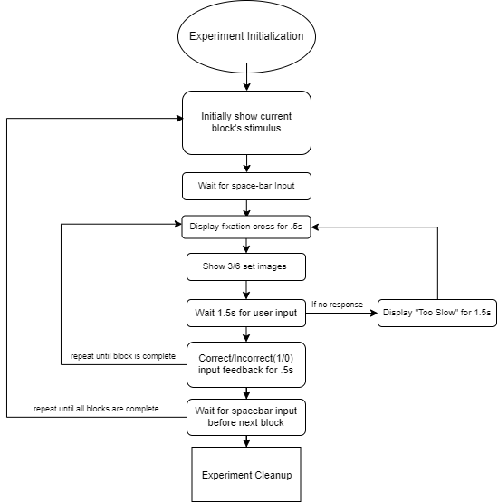
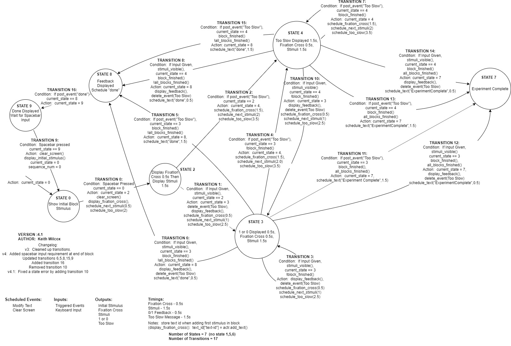

# RLWM_model

### Measures response time of input generated from a computer model that simulates human cognition. University research project

<h2>Experiment Flow</h2>

<h3>Experiment High Level State Machine Design</h3>

